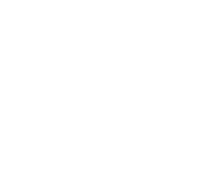
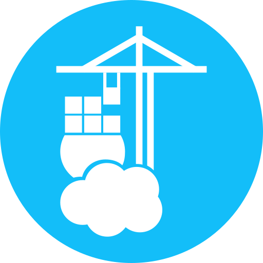
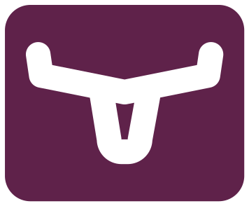

<div align="center">

# homelab

A homelab for self-hosting open source software.

</div>

## Architecture


## Infrastructure Stack

<div align="center">
<table>
  <tr>
    <td align="center" width="200"><b>Infrastructure & Orchestration</b></td>
    <td align="center">
      <table>
        <tr>
          <td align="center"><br/><b>Terraform</b></td>
          <td align="center"><br/><b>Ansible</b></td>
          <td align="center"><br/><b>Docker</b></td>
          <td align="center"><br/><b>Kubernetes</b></td>
        </tr>
      </table>
    </td>
  </tr>
  <tr>
    <td align="center" width="200"><b>Virtualization & Operating Systems</b></td>
    <td align="center">
      <table>
        <tr>
          <td align="center"><br/><b>Proxmox</b></td>
          <td align="center"><br/><b>Ubuntu Linux</b></td>
          <td align="center"><br/><b>Talos Linux</b></td>
        </tr>
      </table>
    </td>
  </tr>
  <tr>
    <td align="center" width="200"><b>Networking & Security</b></td>
    <td align="center">
      <table>
        <tr>
          <td align="center"><br/><b>Cloudflare</b></td>
          <td align="center"><br/><b>Tailscale</b></td>
          <td align="center"><br/><b>Caddy</b></td>
          <td align="center"><br/><b>Traefik</b></td>
        </tr>
      </table>
    </td>
  </tr>
  <tr>
    <td align="center" width="200"><b>Cloud & DevOps</b></td>
    <td align="center">
      <table>
        <tr>
          <td align="center"><br/><b>AWS</b></td>
          <td align="center"><br/><b>FluxCD</b></td>
        </tr>
      </table>
    </td>
  </tr>
  <tr>
    <td align="center" width="200"><b>Monitoring & Observability</b></td>
    <td align="center">
      <table>
        <tr>
          <td align="center"><br/><b>Prometheus</b></td>
          <td align="center"><br/><b>Grafana</b></td>
          <td align="center"><br/><b>Loki</b></td>
        </tr>
      </table>
    </td>
  </tr>
  <tr>
    <td align="center" width="200"><b>Applications & Databases</b></td>
    <td align="center">
      <table>
        <tr>
          <td align="center"><br/><b>n8n</b></td>
          <td align="center"><br/><b>PostgreSQL</b></td>
          <td align="center"><br/><b>Commafeed</b></td>
          <td align="center"><br/><b>Dokploy</b></td>
          <td align="center"><br/><b>Portainer</b></td>
          <td align="center"><br/><b>Longhorn</b></td>
        </tr>
      </table>
    </td>
  </tr>
</table>
</div>

## Setup

The entire homelab can be provisioned with a single command:

```bash
terraform apply
```

This will:

1. **Setup Secrets Manager** - Create an AWS SSM Parameter Store for all secrets
2. **Configure Cloudflare DNS** - Set up CNAME records for all deployed services behind a reverse proxy.
3. **Provision VMs** - Create 3 Talos Linux VMs on Proxmox (1 control plane, 2 workers) with:
   - 2 cores, 2GB RAM, 20GB disk each
   - Static IPs
   - Custom Talos image with QEMU guest agent and Tailscale extensions
4. **Bootstrap Kubernetes** - Initialize a 3-node Kubernetes cluster:
   - Generate machine secrets and certificates
   - Apply machine-specific patched Talos configurations
   - Bootstrap etcd and Kubernetes API server on the control-plane node
5. **Set up Tailscale** - Configure VPN networking:
   - Create Access Control Lists (ACLs) for network policies
   - Generate OAuth2 client credentials for Kubernetes Operator integration
   - Auto-enroll all VMs in the Tailscale network
6. **Deploy applications**
   - Automatically discover and create namespaces from `kubernetes/apps/` directories
   - Deploy all Kubernetes manifests (deployments, services, ingress, PVCs)
   - Install Tailscale Operator via Helm for secure ingress management
